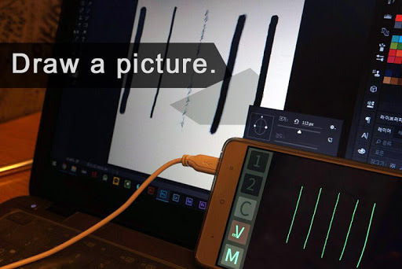
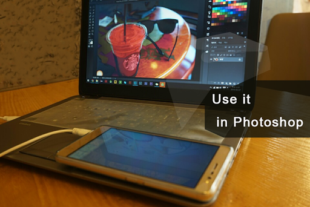

# tablet-stylus-lite   

Tablet stylus : Use the phone as a tablet!   

`updated` : 2016년 9월 5일    
`status` : paused (pro version also paused)  

~~~
***************Light version. Some features are limits .***********

UPADTE LOG

[Update] ver 1.44
* The men who did not use a server crash has also been updated available.
- Replaced by setting the port number to connect directly.
- Change the port number when the server crashes.
- Other inquiries , please send e-mail.

[ver 1.34],PC[ver 1.34P]
*error fixed.
*Shortcuts registered improvements.
*PC program enrollment.(Shortcut)
*drawing,moving,right click Shortcuts can be selected.
*Additional pc -side updates shortcuts.
*Add your pc test program.(homepage down)

PC [ver 1.23P]
"Moving Key" has been added. "Moving Key" Block all 'drawing' feature in the app. Only move the pointer. When ‘mV’ button on in 1:1 Mode, You can take advantage of this.
you can use it by press keyboard ‘n ’ button.

[ver 1.23]
Push Notification Service have been added. 
When pc program or app updates, the  push alarm is shown

[ver 1.13]
Add tool button, and add ‘Color pick’. 
'Color pick' will copy the color end of the mouse point, And copy to the clipboard. 

You can use the mobile phone as a tablet.
Using a usb & wi-fi to connect to a PC.

* Recommended for usb connection. wi-fi connection is slow or the reaction may be unstable.
*The sharp end of the stylus is recommended.

[function]

1. The mode can be set (trackpad mode, 1: 1 mode)

<Trackpad mode>
It works like a trackpad on a laptop.
Easy to use.
With a small screen is recommended.

<1 : 1 mode>
The screen of the phone screen and pc spot is 1: 1 ratio to match.
The operations such as tablets.
With a large screen is recommended.
(Turn off the mV button and recommended to use the right CTRL key.)

2. The basic mouse functions
3. Move the mouse pointer sensitivity setting (trackpad mode)
4. Hotkeys.

* Easily to use like a pen to draw perform such functions through the V button (app), and the right CTRL key.
* Detailed action can be found via the manual internal Apps view.
* Lite version is not specified, the shortcut function, contains advertising.

setting video :

https://youtu.be/Ui1kTOFRSns

****** This application requires the PC-side program. ******

http://hanulc.wixsite.com/tablet

You can get the program from the above site.
For more information please use the guidebook in the app.

*********************************************************************

If you use the handwriting stabilization plug-ins like 'Lazy Nezumi pro'
You can use it to more good quality.

*********************************************************************
~~~   

   

